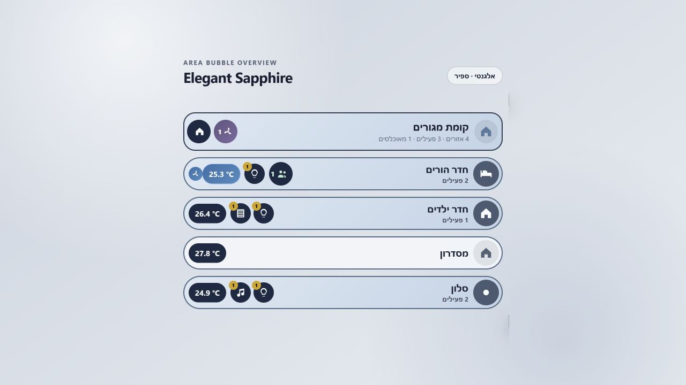
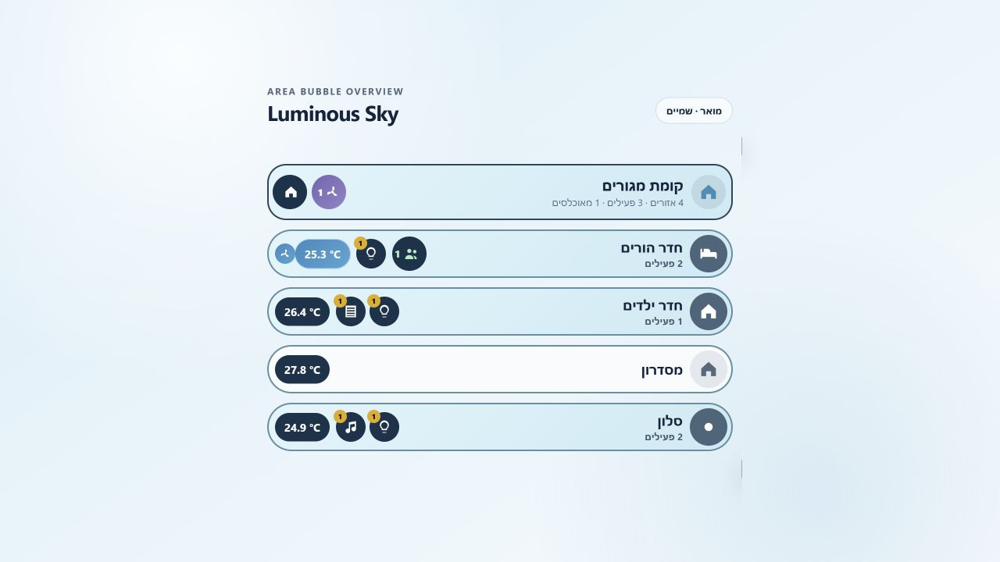
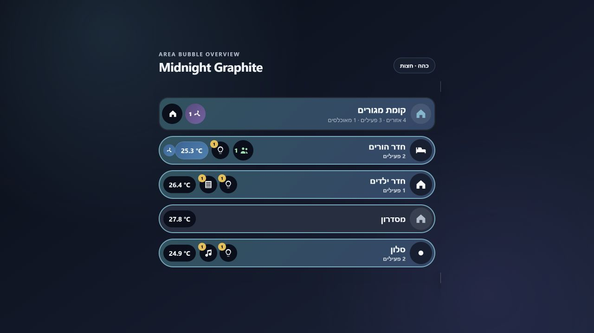
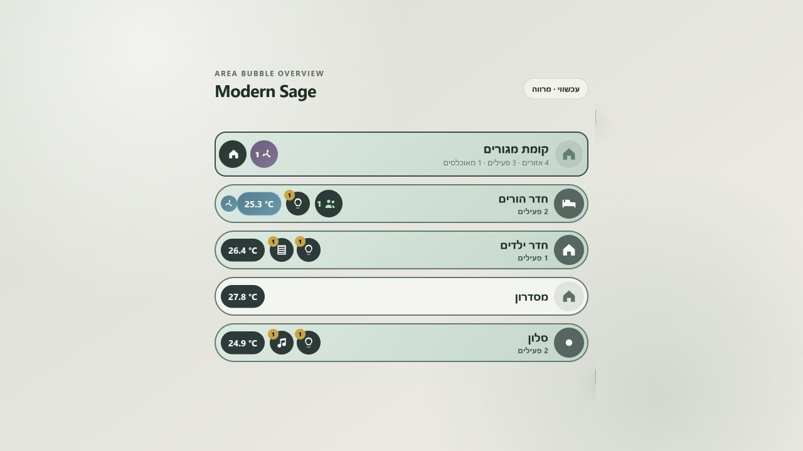

# Overview design themes

Area Bubble Overview ships with four coordinated professional themes plus the original classic appearance. A theme controls the card, inactive and active surfaces, device surfaces, controls, climate and temperature states, frames, presence indicators, typography colors, glass blur, radius, and shadows as one coherent palette.

Themes do not change discovery, device order, room hierarchy, actions, popup/expander behavior, visibility, or safety settings.

## Choose a theme

In the visual editor, open **Appearance and language** and select a card under **Design theme**. The preview swatches show the active surface, control surface, and accent family.

YAML uses `theme_preset`:

```yaml
type: custom:area-bubble-overview-card
id: main-floor
floor: main_floor
theme_preset: elegant
```

Accepted values are:

| Value | Display name | Character |
| --- | --- | --- |
| `classic` | Classic | Original theme-aware appearance; remains the default for existing cards. |
| `elegant` | Elegant Sapphire | Muted sapphire, cool metal, calm contrast, and a refined frosted surface. |
| `light` | Luminous Sky | Clean white, soft sky blue, low visual weight, and an airy dashboard feel. |
| `dark` | Midnight Graphite | Deep graphite and navy with restrained teal details and high-contrast text. |
| `modern` | Modern Sage | Warm neutral surfaces, desaturated sage, and a quiet contemporary character. |

## Theme gallery

### Elegant Sapphire



### Luminous Sky



### Midnight Graphite



### Modern Sage



## Presets and manual overrides

The selected preset is the base. Explicit `style.*` values are applied afterward, so a single value can be changed without copying an entire palette:

```yaml
theme_preset: dark
style:
  active_surface: "linear-gradient(135deg, #264f5c 0%, #364b70 100%)"
  area_frame_color: "#77b8ca"
  area_frame_width: 2
```

Selecting another theme in the visual editor removes previous theme-color overrides so the new palette is visible immediately. Layout settings such as row height, category spacing, quick-action size, and room-name size are preserved. Any manual changes made after selecting the new theme continue to override it.

## Gradients

The built-in gradients are intentionally low-saturation and use nearby tones rather than contrasting rainbow colors. They are used on the card, active rooms, climate controls, and temperature states to add depth without visual noise.

Any CSS background value can be entered in a visual editor color text field. For example:

```yaml
style:
  card_transparent: false
  card_background: "linear-gradient(150deg, rgba(250,252,255,.98), rgba(226,235,246,.96))"
  temperature_cool_surface: "linear-gradient(135deg, #2875a8, #4295bd)"
```

The native color square accepts solid colors. Use the adjacent CSS text input for gradients, `rgba()`, `color-mix()`, or Home Assistant CSS variables.

## Transparency

Every professional preset supplies a card gradient and therefore defaults to `card_transparent: false`. To reveal the dashboard wallpaper while keeping the rest of the palette:

```yaml
theme_preset: modern
style:
  card_transparent: true
```

This removes the outer card background, border, and shadow. Room, category, status, and control surfaces keep the selected preset.

## Text and contrast

Themes use four semantic text colors:

| Key | Used for |
| --- | --- |
| `style.primary_text_color` | Room names, headings, and main content. |
| `style.secondary_text_color` | Counts, helper text, entity states, and subtitles. |
| `style.active_text_color` | Text placed on active room, device, and climate surfaces. |
| `style.control_text_color` | Icons and text inside dark action and temperature pills. |

The shipped palettes are regression-tested at a minimum 4.5:1 contrast ratio for active-device and control combinations. If a surface is customized, adjust its semantic text color at the same time.

## Full example

```yaml
type: custom:area-bubble-overview-card
id: living-floor-overview
floor: living_floor
language: he
rtl: true
theme_preset: elegant
show_floor_expand_button: false
show_area_expand_button: false
area_open_mode: popup
quick_actions_position: opposite
style:
  area_name_size: 16
  quick_action_size: 36
  category_gap: 16
  area_frame_width: 2
```

## Returning to the Home Assistant theme

Choose **Classic** in the visual editor or set:

```yaml
theme_preset: classic
```

Classic follows Home Assistant theme variables and preserves the original Area Bubble Overview appearance.
